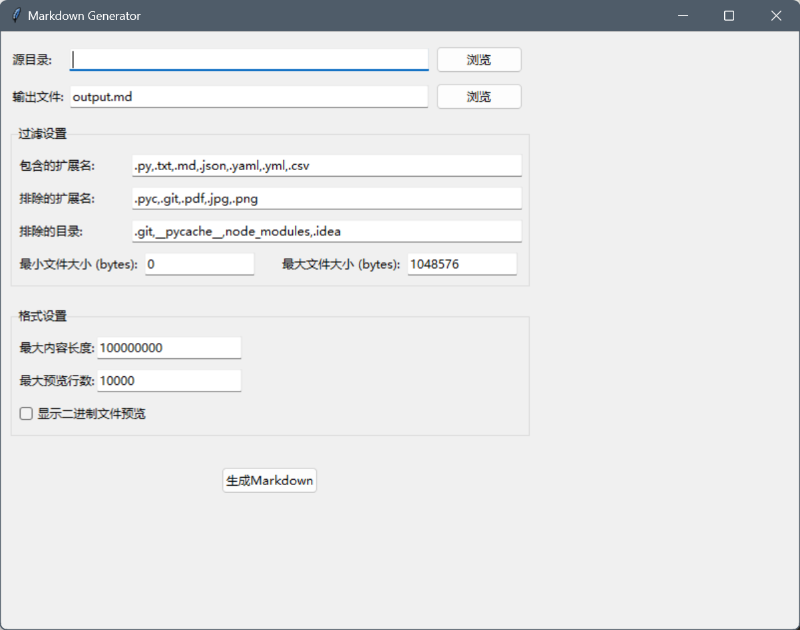

# Markdown Generator
一个带有图形界面的项目文档自动生成工具。

## 功能特点
- 图形用户界面
- - 支持多种文件类型
- - 自定义过滤规则
- - 灵活的格式化配置
## 使用方法
1. 运行程序打开图形界面2
2. . 选择源代码目录和输出文件
3. 3. 按需调整过滤和格式化选项
4. 4. 点击"生成Markdown"按钮
## 过滤设置
- 默认包含: .py, .txt, .md, .json, .yaml, .yml, .csv
- 默认排除: .pyc, .git, .pdf, .jpg, .png
- 排除目录: .git, __pycache__, node_modules, .idea
- 大小限制: 最大1MB
## 系统要求
- Python 3.x
- tkinter库支持
- 全平台支持(Windows/Linux/MacOS) 
